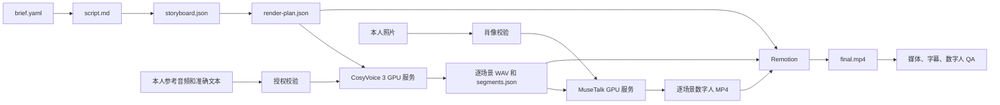

# AI-Remotion 数字人和声音克隆开发计划

状态：计划已确认，待分阶段实施
日期：2026-07-21
项目：AI-Remotion

## 1. 目标

在现有 CLI/Agent-first 的 AI-Remotion 流水线上，增加两项能力：

1. 使用用户本人或已获得明确授权的参考音频进行声音克隆。
2. 上传一张已授权的人像照片，生成数字人讲解片段，并与旁白、字幕、图文场景一起渲染为最终 MP4。

第一版保持本地优先：

- Mac 负责 CLI、episode 文件、Remotion 合成和 QA。
- NVIDIA GPU 服务器负责 CosyVoice 和数字人模型推理。
- 通过 Tailscale 私网或 SSH 隧道访问模型服务。
- 不增加浏览器 UI。
- 不自动发布视频。

## 2. 案例技术判断

用户提供的案例包含多个不同类型的模型，不能直接视为同一个数字人模型：

- **CosyVoice 3**：文本转语音和声音克隆。
- **Krea 2 / GPT Image 2**：静态图片生成或编辑。
- **LTX-2.3 / Seedance 2.0**：通用音视频生成；Seedance 2.0 可作为经明确云端数据处理同意后的全身主播 provider。
- **MuseTalk / LatentSync / Hallo2 / EchoMimic 等**：专门的肖像动画或口型同步模型。
- **Hyperframes / Remotion**：确定性的视频排版、合成和最终渲染。
- **Claude Code、Fable、Grok CLI**：分析和编排工具，不是视频生成模型。

第一版推荐使用：

```text
脚本
  -> CosyVoice 3 声音克隆
  -> 逐场景 WAV

授权照片 + 逐场景 WAV
  -> MuseTalk 数字人口型同步
  -> 逐场景数字人 MP4

图文场景 + 数字人片段 + 字幕 + 音轨
  -> Remotion
  -> final.mp4
  -> QA
```

MuseTalk 继续作为本地、单照片口型同步的回退路径。Seedance 2.0 作为可关闭的云端全身主播 provider：它需要将已授权的人像和场景音频上传到私有 TOS URL，并以 Ark 异步任务生成每段视频。因为人物一致性、成本、审核、口型和动作质量具有不确定性，必须先单场景预检、记录任务元数据，并在失败时保留 MuseTalk 或图文回退。

LatentSync 作为本地、无云端按视频计费的中文口型同步候选。它以已有源视频和场景 WAV 为输入，优先保证嘴型；使用静态照片生成的循环源视频只能验证口型，不能承诺自然表情或头部动作。LatentSync 1.6 的源码为 Apache-2.0，但运行所需模型权重仍应逐项核对许可。

## 3. 当前基础与关键缺口

### 已有能力

- DeepSeek 脚本生成。
- CosyVoice 预置 speaker。
- 逐场景语音生成和真实时长测量。
- 根据语音时长重新计算 scene frames。
- SRT 字幕生成。
- Remotion MP4 渲染。
- 音频 staging、音轨检查、时长检查和 QA 帧生成。

主要代码入口：

- [src/audio/voiceover.ts](../src/audio/voiceover.ts)
- [src/audio/sceneTiming.ts](../src/audio/sceneTiming.ts)
- [src/cli/generateVoiceover.ts](../src/cli/generateVoiceover.ts)
- [src/render/episodeRender.ts](../src/render/episodeRender.ts)
- [src/remotion/templates/ExplainerVideo.tsx](../src/remotion/templates/ExplainerVideo.tsx)
- [src/schemas/artifacts.ts](../src/schemas/artifacts.ts)

### 当前缺口

1. 本机安装的是 `CosyVoice-300M-SFT`，不是 CosyVoice 3。
2. 当前 CosyVoice FastAPI 的 zero-shot/cross-lingual 路径存在文件路径与音频 tensor 参数不匹配问题。
3. 没有声音和肖像授权文件契约。
4. 没有声音克隆 provider。
5. 没有数字人或口型同步 provider。
6. Remotion 当前主要渲染文本和卡片，尚未正式渲染图片及数字人视频素材。
7. QA 尚未检测数字人片段、人脸存在、口型区域和肖像授权。
8. 当前开发 Mac 为 M1 Pro / 32GB，不能作为 CUDA 数字人模型的标准运行环境。

## 4. 目标架构



### 运行边界

- **本机**：episode 文件、CLI、Remotion、FFmpeg、QA。
- **GPU 服务器**：CosyVoice 3、MuseTalk，后续可选 LivePortrait/LTX。
- **网络**：仅允许通过 Tailscale 私网或 SSH 隧道访问。
- **模型服务**：不直接读取任意本机路径，只接受明确上传的音频、照片和文本。
- **安全**：模型服务默认不暴露公网，不使用明文密码，不把个人生物特征文件提交到 Git。

## 5. Episode 产物设计

```text
episodes/<episode-id>/
├── brief.yaml
├── script.md
├── storyboard.json
├── render-plan.json
├── rights.yaml
├── assets/
│   ├── avatar-source.jpg
│   └── avatar/
│       ├── scene-01.mp4
│       └── scene-02.mp4
├── audio/
│   ├── voice-reference.wav
│   ├── voiceover.wav
│   ├── segments.json
│   └── segments/
│       ├── scene-01.wav
│       └── scene-02.wav
├── captions.srt
├── out/final.mp4
└── qa-report.md
```

### rights.yaml

```yaml
voice:
  subject: self
  consent_confirmed: true
  reference_audio: audio/voice-reference.wav
  reference_transcript: "与录音完全一致的文本"
  permitted_use: product_explainer

portrait:
  subject: self
  consent_confirmed: true
  source: assets/avatar-source.jpg
  permitted_use: product_explainer
```

规则：

- `consent_confirmed` 缺失或为 `false` 时，在上传到模型服务前直接失败。
- `subject: self` 只表示用户声明本人；商业使用仍需遵守实际授权和肖像权要求。
- 参考音频、源照片、克隆输出和数字人视频默认加入 `.gitignore`。
- 日志只能记录文件名、哈希和元数据，不能记录完整音频、照片或 API key。

## 6. CLI 设计

建议增加以下命令：

```bash
# 检查授权文件、参考音频、照片、模型服务和运行配置
npm run episode:avatar:check -- --episode product-avatar

# 使用本人声音生成逐场景旁白
npm run episode:voice -- \
  --episode product-avatar \
  --provider cosyvoice-clone \
  --reference-audio audio/voice-reference.wav \
  --reference-text "与录音完全一致的文本"

# 根据照片和逐场景语音生成数字人片段
npm run episode:avatar -- \
  --episode product-avatar \
  --provider musetalk \
  --photo assets/avatar-source.jpg

# 生成字幕、渲染和 QA
npm run episode:captions -- --episode product-avatar
npm run episode:render -- --episode product-avatar
npm run episode:qa -- --episode product-avatar --render-frames
```

批处理流程调整为：

```text
validate
  -> script
  -> storyboard
  -> render-plan
  -> voice
  -> captions
  -> avatar
  -> render
  -> qa
```

声音克隆或数字人生成失败时必须停止，不得静默切换陌生预置音色、空白人物或无声视频。

## 7. 分阶段开发计划

### 阶段 0：BIOS、许可和服务器基线

工作内容：

- 建立或复用可追踪 BIOS 工单。
- 核对 CosyVoice 3、MuseTalk、LivePortrait 及依赖模型的商业许可。
- 检查 NVIDIA 服务器 GPU、显存、CUDA、磁盘、FFmpeg 和 Tailscale。
- 记录当前中文样片的时长、音质和渲染结果，作为回归基线。
- 将现有 `npm audit` 的 `brace-expansion` 问题单独处理，不与数字人改动混合。

验收：

- GPU、驱动和服务器连通性有实际命令证据。
- 模型和依赖许可清单完成。
- 未经授权的音频或肖像不能进入测试 episode。

### 阶段 1：数据契约、安全门和特性开关

主要文件：

- [src/schemas/artifacts.ts](../src/schemas/artifacts.ts)
- [src/schemas/episodeArtifacts.ts](../src/schemas/episodeArtifacts.ts)
- [src/config/runtimeConfig.ts](../src/config/runtimeConfig.ts)
- [flags/feature-flags.ts](../flags/feature-flags.ts)
- [config/.env.dev.example](../config/.env.dev.example)
- [config/.env.prod.example](../config/.env.prod.example)

新增契约：

- `rights.yaml`
- `voice_profile`
- `avatar`
- `audio/segments.json`
- 数字人 clip 路径、模型版本和生成元数据。

新增开关，默认全部关闭：

- `FLAGS.VOICE_CLONE`
- `FLAGS.TALKING_AVATAR`
- `FLAGS.AVATAR_MOTION`
- `FLAGS.GENERATIVE_BROLL`

验收：

- 缺少授权、照片、参考音频或准确文本时明确失败。
- 旧 episode 不包含 avatar 字段时仍可正常验证和渲染。
- 路径不能越出 episode 目录。
- API key、照片、参考音频不会出现在日志中。

### 阶段 2：部署 CosyVoice 3

服务器侧工作：

- 下载并校验官方 `Fun-CosyVoice3-0.5B-2512`。
- 新建隔离 Python/Conda 环境。
- 不继续依赖当前有缺陷的 v1 FastAPI cloning 路径。
- 提供受控接口：
  - `/health`
  - `/model-info`
  - `/inference_zero_shot`
  - `/inference_cross_lingual`
- 仅监听 Tailscale 地址或 localhost + SSH tunnel。
- 增加请求大小、音频时长、并发和超时限制。

参考音频要求：

- 本人清晰干声。
- 建议 6–15 秒，最长不超过 30 秒。
- 无音乐、回声、降噪伪影和多人声音。
- 16kHz 以上、单声道 WAV。
- 提供与录音完全一致的文本。

验收：

- 同一参考音频可合成至少三段不同文本。
- 输出 WAV 可被 `ffprobe` 正确识别。
- 服务器异常时 CLI 报出具体原因。
- 不在日志中输出完整参考文本或音频内容。

### 阶段 3：接入声音克隆 Adapter

主要文件：

- [src/audio/voiceover.ts](../src/audio/voiceover.ts)
- [src/audio/voiceoverConfig.ts](../src/audio/voiceoverConfig.ts)
- 新增 `src/audio/cosyVoiceClone.ts`
- [src/cli/generateVoiceover.ts](../src/cli/generateVoiceover.ts)
- [src/audio/wav.ts](../src/audio/wav.ts)
- [src/audio/sceneTiming.ts](../src/audio/sceneTiming.ts)

实现：

- 增加 `cosyvoice-clone` provider。
- 支持 multipart 上传参考音频。
- 逐镜头合成并测量真实时长。
- 复用现有 scene timing 算法更新字幕和镜头。
- 写入 provider、模型版本、参考音频哈希和生成时间。
- 不把参考音频复制到公开输出目录。

验收：

- 有授权的参考音频可以成功生成旁白。
- 未确认授权时请求在上传前失败。
- 多场景语音合并后无丢帧、截断或重叠。
- 视频计划与音频总时长误差不超过一帧。

### 阶段 4：MuseTalk 数字人 MVP

服务器侧建立独立 avatar 服务：

- `/health`
- `/model-info`
- `/generate`

输入：

- 照片。
- 单场景 WAV。
- 裁剪和输出参数。

输出：

- 无重复音轨的场景 MP4。
- 输出模型版本、参数和输入哈希。

MVP 策略：

1. 校验单人正脸照片。
2. 按 9:16 安全区生成半身布局。
3. 将照片扩展成与语音等长的基础视频。
4. 使用 MuseTalk 生成口型。
5. 每个场景单独生成，失败后只重试该场景。
6. Remotion 最终统一叠加声音，避免重复音轨。

第一版暂不实现：

- 全身动作。
- 多人物对话。
- 实时直播。
- 自动换装。
- 未成年人数字人。
- 自动从网络抓取人像。

验收：

- 单照片 + 单 WAV 能输出可播放 MP4。
- 视频尺寸、fps 和时长符合契约。
- 人脸在首、中、尾帧均存在且非空白。
- 失败场景不会破坏已成功场景。
- 相同输入和参数能够复用缓存。

### 阶段 5：Remotion 数字人场景

主要文件：

- [src/remotion/templates/ExplainerVideo.tsx](../src/remotion/templates/ExplainerVideo.tsx)
- 新增 `src/remotion/episodeAssets.ts`
- [src/render/episodeRender.ts](../src/render/episodeRender.ts)
- [src/remotion/Root.tsx](../src/remotion/Root.tsx)

新增渲染模式：

- `talking_avatar_full`：数字人占主要画面。
- `talking_avatar_pip`：数字人画中画，保留图文卡片。
- `graphics_only`：兼容现有图文讲解。
- `avatar_intro_outro`：只在开头和结尾出现数字人，作为首个产品样片的推荐模式。

实现要求：

- 使用 Remotion `OffthreadVideo` 渲染数字人 clip。
- 将数字人素材临时 staging 到 Remotion public 目录。
- 渲染完成后清理 staged 文件。
- 缺少 clip 时明确失败。
- 字幕不能覆盖数字人嘴部和主视觉。
- 同一 episode 可以混合数字人镜头和现有卡片镜头。

验收：

- 旧 canonical demo 不受影响。
- 数字人产品介绍视频包含正常声音、字幕和人物画面。
- 临时 public 文件不会残留。
- 关闭 feature flag 后完全回到原图文流程。

### 阶段 6：数字人 QA

扩展：

- [src/qa/report.ts](../src/qa/report.ts)
- [src/cli/generateQaReport.ts](../src/cli/generateQaReport.ts)
- [src/qa/frameTargets.ts](../src/qa/frameTargets.ts)

新增检查：

- 授权文件存在且有效。
- 数字人源照片和生成 clip 存在。
- MP4 音视频流完整。
- 每个 clip 时长和场景时长匹配。
- 首、中、尾帧检测到人脸。
- 视频无连续黑帧或冻结异常。
- 字幕不覆盖嘴部安全区域。
- 音轨不是静音。
- 记录模型和生成参数。
- 输出人工检查身份一致性、口型、异常牙齿和眨眼提示。

口型验收分为两层：

1. 自动检查：音视频时长、嘴部区域运动、静音段稳定性。
2. 人工检查：使用固定中文和英文测试句确认口型自然度。

### 阶段 7：运动增强

数字人 MVP 稳定后再加入：

```text
照片
  -> LivePortrait 生成轻微头动和眨眼
  -> MuseTalk 应用口型
  -> Remotion 合成
```

注意：

- LivePortrait 的人脸检测依赖需要单独核对商业许可。
- 必须使用经过许可审查的检测模型。
- 该阶段由 `FLAGS.AVATAR_MOTION` 控制。

### 阶段 8：可选图片和视频模型

#### Krea 2

- 用于生成背景、概念图和产品氛围图。
- 不用于生成用户本人的替代肖像。
- 本地权重受自定义商业许可约束。

#### GPT Image 2

- 作为商业图片 provider。
- 仅在用户显式启用时上传图片。
- 默认关闭，不作为本地优先 MVP 依赖。

#### LTX-2.3

- 用于 B-roll、转场和非关键创意镜头。
- 不作为默认数字人口播引擎。
- 需要单独验证 GPU 显存和模型许可。

#### Seedance 2.0

- 作为商业云视频 provider。
- 账号 API、地区可用性和授权条款验证通过后再接入。

#### Hyperframes

- 当前不替换 Remotion。
- 只有当 Remotion 自动化许可或渲染架构不再合适时，再做独立对比验证。

## 8. 参考视频分析工作流

案例中的“Claude/Fable/Grok 分析原视频”属于后续能力，不是数字人 MVP 的前置条件。

后续可以增加：

```text
参考视频
  -> ffprobe 元数据
  -> 抽帧
  -> ASR 转录
  -> 镜头切分
  -> 视觉和节奏分析
  -> analysis.json
  -> storyboard 建议
```

边界：

- 不绕过模型安全策略。
- 不分析或复刻未经授权的视频人物声音和肖像。
- 不把 Grok CLI 作为唯一依赖。
- 所有分析 provider 通过统一 adapter 接入。
- 分析结果只生成建议，不能覆盖用户编辑过的脚本和 storyboard。

## 9. 测试计划

### 单元测试

- 授权 schema。
- 参考音频校验。
- provider 配置。
- multipart 请求构造。
- 音频分段和合并。
- avatar clip 路径。
- staging 和清理。
- revision routing。
- feature flag 关闭路径。

### 集成测试

- 参考音频 -> CosyVoice 3 WAV。
- 照片 + WAV -> MuseTalk MP4。
- 数字人 MP4 -> Remotion final.mp4。
- 服务异常、超时和重试。
- 缺照片、缺授权和错误音频格式。
- 旧 episode 向后兼容。

### 视觉验证

- 首、中、尾 QA 帧。
- 数字人嘴部区域。
- 字幕安全区。
- 9:16 和 16:9。
- 中文和英文固定测试样本。

交付门禁：

```bash
npm run typecheck
npm run lint
npm test
npm run episode:validate -- --episode avatar-demo
npm run episode:render -- --episode avatar-demo
npm run episode:qa -- --episode avatar-demo --render-frames
make check
make test-integration
```

## 10. 开发 DAG

```text
Round 1 串行：BIOS、许可、服务器基线

Round 2 串行：schema、rights、config、feature flags

Round 3 并行：
  A. CosyVoice 3 服务部署
  B. MuseTalk 服务部署
  C. TypeScript provider 契约和 mock 测试

Round 4 串行：声音克隆 adapter、CLI、scene timing

Round 5 串行：avatar CLI 和 clip 产物契约

Round 6 并行：
  A. Remotion 数字人场景
  B. avatar QA 检查
  C. 文档和部署手册

Round 7 串行：数字人样片和全链路验收

Round 8 可选：LivePortrait、Krea、LTX、商业 provider
```

## 11. 风险和回滚

### 主要风险

- CosyVoice 3 模型下载和 GPU 资源不足。
- 数字人模型依赖冲突或无法在服务器稳定运行。
- 口型同步自然度不足。
- 人脸检测依赖的商业许可不清晰。
- 商业模型 API 价格、地区和服务可用性变化。
- 参考音频和肖像文件泄露。
- 视频生成时长与真实旁白时长不一致。

### 回滚边界

- 关闭 `VOICE_CLONE`：恢复到现有 CosyVoice SFT 或 silent provider。
- 关闭 `TALKING_AVATAR`：恢复到现有图文场景。
- 关闭 `AVATAR_MOTION`：跳过 LivePortrait，只使用基础数字人流程。
- 删除单个 episode 的 avatar 字段和 clip：不影响 `episodes/sample`。
- 模型服务异常不应破坏已有 script、storyboard、render-plan 和 voiceover。

## 12. 预计交付节奏

按单人开发估算：

- 基线、契约和安全门：2–3 天。
- CosyVoice 3 部署及声音克隆：2–4 天。
- MuseTalk 服务和数字人生成：3–5 天。
- Remotion 合成和 staging：2–3 天。
- QA、失败恢复和测试：2–4 天。
- 产品样片和文档：1–2 天。

MVP 总计约 12–21 个有效开发日。主要不确定性来自 GPU 服务器环境、数字人模型依赖和口型调优。

## 13. MVP 完成标准

以下条件全部满足才算完成：

1. 用户放入本人照片、参考音频和准确文本。
2. CLI 在上传前强制验证授权。
3. CosyVoice 3 生成接近本人音色的逐场景旁白。
4. MuseTalk 根据照片和旁白生成口播数字人。
5. Remotion 将数字人、图文卡片、字幕和音轨组成最终 MP4。
6. 字幕和镜头按真实语音时长对齐。
7. 服务失败时明确报错，并可以从失败场景继续。
8. 关闭开关后原有图文视频流程不受影响。
9. 个人生物特征文件不会被提交到 Git。
10. 自动 QA 无 fail，并完成人工声音、肖像和口型验收。
11. BIOS 记录实际命令、验证证据、剩余风险和回滚边界。

实施顺序应先完成阶段 0–3 的声音克隆闭环，再进入数字人开发，避免同时调试两套模型而无法定位问题。
